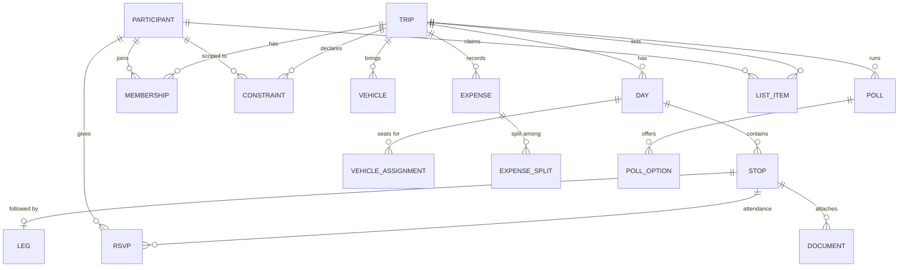
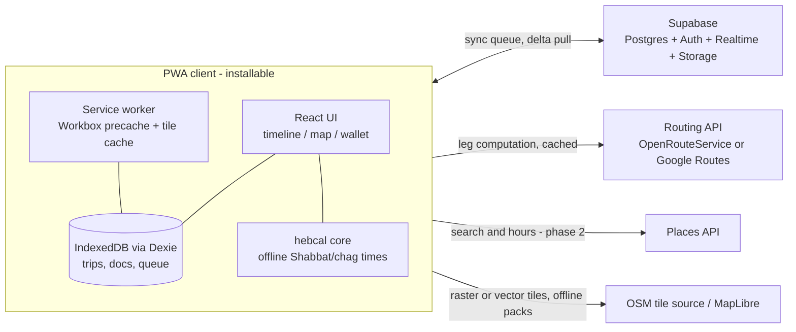

# Tiyul — Multi-Constraint Travel & Group Logistics Planner

**Product design v0.1 · August 2026**
Working name: **Tiyul** (טיול — "trip/outing"). Alternatives: Maslul, Derech, PlanIt.

---

## 1. Problem & vision

Planning a multi-family trip today means a WhatsApp group, two spreadsheets, screenshots of tickets, and one person holding the whole schedule in their head. Nothing checks that the plan actually *works*: that you reach the nature reserve before last entry, that lunch lands inside the kids' meal window, that you're checked into the tzimmer before Shabbat, that there are enough car seats on the day the second family joins.

**Tiyul is a shared, offline-capable trip plan that understands the constraints that shape real family travel — and flags problems at planning time, not in the parking lot.**

### Principles

1. **The plan is a living timeline, not a document.** Every edit recomputes drive times, arrival times, and conflicts.
2. **Constraints are first-class.** Opening hours, meal windows, Shabbat times, drive-stretch limits for kids — the app knows them and checks them continuously.
3. **Offline is the default assumption.** Desert hikes, airplane mode abroad, dead zones in the Golan — the full plan, tickets, and maps must work with zero bars.
4. **Built for groups without friction.** Partial attendance, multiple cars, split costs; people can view and RSVP via a link without installing anything.
5. **Israel-aware, world-ready.** Hebrew calendar, Fri–Sat weekend, kosher filters, Waze deep links — plus time zones, flights, and currencies for trips abroad.

### Why existing tools fall short

- **Spreadsheets/WhatsApp** — no drive times, no conflict checks, no offline bundle, chaos at N families.
- **Google My Maps / Maps lists** — places without a timeline.
- **TripIt** — solo-traveler focused, no group logistics or constraint checking.
- **Wanderlog** — closest competitor; has itineraries + drive times, but no constraint engine, no Shabbat/kosher awareness, weak partial-attendance and vehicle logistics.

---

## 2. Users

| Persona | Needs |
|---|---|
| **The Organizer** (primary) | Plans 4–6 trips/year for 2–3 families. Wants to stop being the human constraint-checker. Power editor. |
| **The Co-planner** | Spouse/friend who edits occasionally, mostly on phone. Needs zero learning curve. |
| **Grandparents** | Join some days. Pace constraints: rest breaks, limited walking, accessible stops. |
| **Kids (3–12)** | Not users, but the source of the hardest constraints: meal windows, nap windows, max continuous drive, kid-friendly activity filters. |
| **The Friends' Family** | Joins day 2–3 only, drives their own car, wants to see "their" schedule and pay their share. Views via link, no install. |

---

## 3. Core scenarios (acceptance narratives)

**S1 — North weekend with grandparents (domestic, Shabbat).**
Two families + grandparents, Thu–Sat in the Golan. The app: computes drive legs with a "kids loading" buffer; flags that the Friday plan reaches the cable car after last entry; auto-inserts Shabbat candle-lighting time for the tzimmer's location and warns the check-in is too tight; filters lunch options to kosher; grandparents RSVP out of the water hike and the plan shows a parallel "easy option" block for them.

**S2 — Two families in Greece (abroad, flights, money).**
Flights anchor day 1 and day 7. Timeline shows local times; the flight day shows both clocks. Villa, boat tour, and car rentals live in the wallet with confirmation QR codes — all available offline. Expenses recorded in EUR, split by who attended each item, settled in ILS at trip end.

**S3 — Friday day-trip with friends (fast, decided by poll).**
Organizer drafts two options (beach day / Ein Gedi day), group votes by Wednesday 20:00, winning option becomes the plan. The app warns the Ein Gedi option: "Snake Path closes at 15:00 for heat — start by 08:30" and checks everyone is home before Shabbat.

---

## 4. Feature specification

### 4.1 Dynamic Itinerary Builder

The core surface: a **day timeline** of time blocks with computed travel legs between them.

- **Structure:** Trip → Days → Stops (activity, meal, lodging, flight, free block). Drag to reorder; drag edges to resize duration.
- **Auto legs:** driving time + distance computed between consecutive stops (routing API, cached). Every edit recomputes depart/arrive times downstream.
- **Buffers:** group profile defaults (e.g., +15 min "loading the car with kids", +10 min parking at popular sites); per-stop override. Buffers render as visible chips, not invisible padding.
- **Anchors vs floaters:** fixed-time items (flights, reservations, guided tours) pin the timeline; flexible items float and slide between anchors. Slack is shown, so you can see where the day can absorb delays.
- **Map pane:** stops pinned per day (color-coded), leg polylines, tap a pin to jump to the block.
- **Deep links:** every leg gets a **Waze** / Google Maps button (Waze is the Israel default); every stop can hold links (official site, booking page).
- **Templates:** duplicate a day or a whole trip; save "our Golan weekend" as a starting point.
- **Parallel tracks (v2):** split the group for part of a day (hikers vs. grandparents+toddlers), rejoining at a shared stop. MVP approximation: parallel "alternative block" with participant tags.

### 4.2 Constraint Engine (the differentiator)

Users declare constraints once; the engine validates the computed schedule after every edit and data refresh.

**Constraint categories**

| Category | Examples | Source |
|---|---|---|
| Temporal | opening hours, last entry, fixed reservation, "home by 21:00" | manual, place data |
| Transit | max continuous drive (per group profile), min buffer between blocks | group profile |
| Human needs | meal windows (kids 12:00–13:30), nap window, rest break every 2h of driving | participant profiles |
| Suitability | kid-friendly, stroller/wheelchair accessible, difficulty ≤ moderate, budget cap | activity tags + filters |
| Calendar | Shabbat/chag entry & exit per location, closed days (Israel: many things closed Sat; abroad: museums closed Mon) | auto (Hebrew calendar lib) + place data |
| Group | enough seats/car seats on each day, headcount vs. reservation size | vehicles + RSVPs |

- **Hard vs. soft:** hard = plan is infeasible (arrive after last entry); soft = quality warning (lunch 40 min past the kids' window). Severity is configurable per constraint.
- **Participant-scoped:** constraints apply only when the affected people attend that stop (grandparents' pace limits don't restrict the couples-only evening).
- **Conflict presentation:** badge on the offending block + a conflicts drawer listing all issues, each with plain-language explanation and **quick fixes**.
- **Quick-fix engine (MVP heuristics, not a full solver):** shift within available slack · shorten a flexible block · swap adjacent stops · insert a rest break · drop-with-confirmation. Each suggestion previews its downstream effect ("pushes dinner to 19:40").
- **Auto-solver (later):** constraint-satisfaction pass that proposes a feasible reordering of a day ("make this day work").

**Initial rule set**

| Rule | Default severity |
|---|---|
| OVERLAP — blocks collide | hard |
| TRANSIT_IMPOSSIBLE — can't reach next stop in time | hard |
| ARRIVE_AFTER_CLOSE / AFTER_LAST_ENTRY | hard |
| CLOSED_DAY — stop closed that weekday/holiday | hard |
| SHABBAT_CONFLICT — activity/drive crosses Shabbat or chag for observant participants | hard (per family profile) |
| SEAT_SHORTAGE — people > seats (incl. car-seat types) that day | hard |
| BOOKING_REQUIRED_MISSING — reserve-ahead site with no booking attached | soft |
| MEAL_WINDOW_MISS / NAP_WINDOW_MISS | soft |
| DRIVE_STRETCH_EXCEEDED — continuous drive > profile max | soft |
| NO_BUFFER — back-to-back anchors with < min buffer | soft |
| HEAT_WINDOW — strenuous southern-Israel hike planned 10:00–16:00 in summer | soft |
| CURFEW_MISS — "home/hotel by X" violated | soft |

### 4.3 Offline-First PWA

Installable PWA (Add to Home Screen, iOS + Android), app shell precached.

- **"Take trip offline"** bundles: full trip data; **map tiles** for bounding boxes around all stops (MapLibre + OSM tiles, zoom 8–15); route geometries and last-computed leg times (stamped "computed Jul 30"); all wallet items (tickets, PDFs, QR codes); constraint data incl. pre-computed Shabbat times (Hebrew calendar lib runs fully offline).
- **Storage manager:** per-trip size estimate, download over Wi-Fi prompt, evict old trips. Budget target ≤ 400 MB/trip (iOS PWA storage limits — test early).
- **Offline editing:** edits queue locally (IndexedDB) and sync on reconnect; MVP conflict policy = last-writer-wins per field with a "changed while you were offline" review list; move to CRDT sync if collaborative editing friction demands it.
- **Wallet:** attach tickets/confirmations (PDF, image, QR) to stops or the trip; one tap from the timeline block at the entrance gate. Sensitive docs (passports) stay device-side in v1 (see Open questions).
- **Status honesty:** every screen shows offline state and data freshness; leg times shown as "as of <date>" when offline.

### 4.4 Group logistics

- **Roles:** organizer / editor / viewer. Invite via link with WhatsApp-friendly preview; viewing and RSVP require **no account** (magic link identity), editing requires sign-in.
- **RSVP per day and per stop:** attendance drives everything — headcounts on each block, restaurant table size, ticket counts, seat checks, expense splits.
- **Vehicles & seating:** define cars (seats, car-seat slots, driver); assign per day; SEAT_SHORTAGE conflicts surface automatically ("Day 2: 11 people, 9 seats").
- **Polls:** options with deadline; auto-close; winning option can insert directly into the timeline.
- **Expenses:** multi-currency entry, payer + beneficiaries (defaults to the stop's attendees), running balances, minimal-transfer settle-up, ILS conversion at trip-average rate, CSV export.
- **Shared lists — shopping & packing:** a consolidated **shopping list** (categories, quantities, "who buys" claims, bought ✓) and a **gear/packing list** with claims ("who brings the mangal"), plus personal checklists from templates (beach day, hike, flight abroad). A bought item converts to an expense in one tap, split among its beneficiaries (default: the whole group). Lists are editable from the accountless share link — any parent can tick items from the supermarket aisle.

### 4.5 Israel pack

- **Hebrew calendar awareness:** candle-lighting/havdalah per location & date (via `@hebcal/core`, offline-capable); chagim auto-marked; per-family observance profile decides whether Shabbat generates hard constraints, soft warnings, or nothing.
- **Fri–Sat weekend logic:** opening-hours checks understand erev-Shabbat early closures and Saturday closures.
- **Kosher filters:** restaurant suggestions filterable by certification level (rabbanut / mehadrin); meat/dairy tagging for meal planning.
- **Nature & parks:** "booking required" flags (Masada sunrise, Ein Gedi in season), Israel Nature & Parks pass (Matmon) noted on relevant stops, seasonal advisories — summer heat windows for southern hikes, winter flash-flood risk in desert wadis.
- **Navigation reality:** Waze deep links as the primary nav action; Moovit link for transit users.
- **Optional safety layer:** regional advisories (Home Front Command guidelines) as an opt-in informational layer on trip areas.
- **Language:** full Hebrew UI with RTL layout; dates shown in Gregorian + Hebrew calendar where relevant.

### 4.6 Abroad pack

- **Time zones:** every stop carries its zone; timeline renders local time; flight days show origin+destination clocks; "call home" helper shows the offset.
- **Flights:** structured flight blocks (PNR, terminal, gate notes) with check-in reminder offsets (T-24h) and airport-buffer defaults (international: 3h).
- **Money:** expenses in local currency, trip base currency, offline-cached exchange rate with manual override.
- **Pre-trip checklist:** passports validity, visas, travel insurance, roaming/eSIM, plug type & voltage per country, driving-side note.
- **Observant travel (optional):** kosher restaurant / Chabad locator links per city; Shabbat times work worldwide automatically (hebcal is location-based).

---

## 5. Information architecture

```
Trips list
└── Trip home  [tabs: Plan · People · Lists · Wallet · Money]
    ├── Plan   → Day strip → Day timeline (core screen) ⇄ map view (per-day / whole-trip)
    │            ├── Stop details (times, links, tickets, attendees, constraints)
    │            ├── Leg details (route, Waze button, buffer)
    │            └── Conflicts drawer (all days or per day)
    ├── People → members, roles, RSVPs grid (people × days), vehicles & seats
    ├── Lists  → shopping (categories, qty, who-buys, bought ✓ → expense) ·
    │            gear/packing claims · personal checklists
    ├── Wallet → tickets/docs by day, offline status per item
    ├── Money  → expenses, balances, settle-up
    └── Trip settings → offline bundle, sharing, profiles (buffers, meal/nap windows,
                        observance level, drive limits), base currency, language

The map is a view mode of Plan (timeline ⇄ map toggle), not a separate destination —
keeps the tab bar at five and matches how the day editor already pairs them.
```

---

## 6. Data model



**Key entities (abridged fields)**

- **Trip** — name, date range, base currency, locale, offline-bundle state, share settings.
- **Day** — date, note, color; derived: Shabbat/chag flags per lodging location.
- **Stop** — type (activity/meal/lodging/flight/free), place (name, lat/lng, address, links), planned start/duration, anchor?, buffer override, tags (kosher, kid-friendly, accessible, booking-required), cost estimate.
- **Leg** (derived, cached) — from/to stop, mode, distance, duration, polyline, computed-at timestamp.
- **Participant** — name, contact, profile (meal/nap windows, drive tolerance, observance level, mobility), is-child + car-seat type.
- **Constraint** — type, scope (trip/day/stop/participant-set), params, severity.
- **Conflict** (derived) — rule id, severity, blocks involved, message, suggested fixes.
- **Expense** — amount, currency, payer, linked stop?, split mode, beneficiaries.
- **Document** — kind (ticket/QR/PDF/note), file ref, linked stop/day, offline-pinned.
- **ListItem** — kind (shopping / packing), category, label, quantity + unit, note, claimed-by (family/person), status (open / bought / packed), linked expense (optional).

---

## 7. Architecture & stack



| Decision | Choice | Rationale |
|---|---|---|
| App model | **PWA** (React + TypeScript + Vite) | Screenshot requirement; one codebase; installable; no app-store friction for family/friends |
| Offline | Workbox SW + **Dexie/IndexedDB** + per-trip bundles | Proven PWA offline stack |
| Maps | **MapLibre GL** + OSM tiles | Open licensing allows offline tile packs (Google Maps tiles can't be cached) |
| Drive times | **OpenRouteService** first (free tier), abstraction layer so Google Routes API can swap in | Cost control; cached aggressively; frozen values offline |
| Hebrew calendar | **`@hebcal/core`** in-client | Accurate zmanim per lat/lng, fully offline |
| Backend | **Supabase** (Postgres, Auth, Realtime, Storage) | Fast to ship; realtime channels give live group editing; row-level security for share links |
| Sync policy | Offline queue + LWW-per-field (MVP) → CRDT (Yjs/PowerSync) if needed | Don't pay CRDT complexity before group-edit friction proves it |
| i18n | i18next, **he + en, full RTL** | Family reality |
| Auth | Google + phone OTP; viewer links need no account | Lowest friction for the group |
| Hosting | Vercel/Netlify + Supabase cloud | Zero-ops |

**Places/opening-hours data:** MVP = manual entry + paste-a-link (Google Maps URL parsed for name/coords). Phase 2 = Places API for search, hours, and "closed that day" checks. This avoids the biggest external cost until the core proves itself.

---

## 8. Roadmap

| Milestone | Scope | Exit criterion |
|---|---|---|
| **M0 — Skeleton** (~2–3 wks) | Trip/day/stop CRUD, drag timeline, manual durations, Waze links, local-only storage | Plan a real day trip and use it in the field |
| **M1 — It thinks** (~6–8 wks) | Auto drive legs + buffers, anchors/floaters, core conflicts (overlap, transit, closing, Shabbat, curfew), offline bundle v1 (data + wallet), read-only share link | The app catches a real planning mistake before the trip does; full plan usable in airplane mode |
| **M2 — It's social** | Accounts/roles, RSVPs per day/stop, polls, vehicles & seat checks, expenses v1 + settle-up, shared shopping/gear lists v1 (claims, bought ✓ → expense) | A friend joins day 2 by link, RSVPs, ticks shopping items, sees their cost — no install |
| **M3 — It's deep** | Offline map tiles, quick-fix suggestions, meal/nap/heat rules, packing templates, abroad pack (time zones, flights, currency), Places API integration | Full S1 and S2 scenarios pass end-to-end |
| **Later** | Auto-solver ("make this day work"), transit mode, parallel group tracks, AI trip drafting ("3 days in the Golan with a 3-year-old"), calendar export | — |

---

## 9. Non-goals (v1)

- Booking or payments inside the app (link out to booking pages).
- Chat (WhatsApp already won; we integrate via share links).
- Turn-by-turn navigation (deep-link to Waze/Google Maps).
- Flight/hotel search or price tracking.
- Public/social trip feeds.

## 10. Open questions

1. **Places data cost** — when does Places API (paid) beat manual entry + link parsing? Decide during M2 with real usage.
2. **CRDT now vs. later** — how much simultaneous editing actually happens in family groups? Instrument M2.
3. **iOS PWA storage ceilings** — validate 300–400 MB tile bundles on iOS Safari early in M3; fallback = smaller zoom range or region packs.
4. **Passports/IDs in wallet** — encrypted storage is a liability; v1 keeps official IDs out (device gallery instead). Revisit only with strong demand.
5. **Safety advisories layer** — include Home Front Command feed at launch or keep manual? Opt-in either way.

## 11. Success criteria

- A 3-day, 2-family north trip planned in **under 30 minutes**.
- **100% of the trip** — schedule, tickets, maps, Shabbat times — readable in airplane mode.
- Zero "arrived after closing / missed last entry" incidents across real family trips in the first season.
- At least one friend-family participates fully (RSVP + expenses) **without installing anything**.
