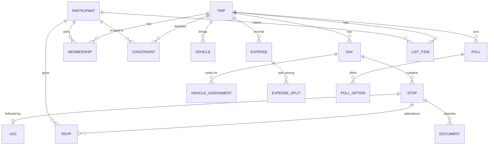
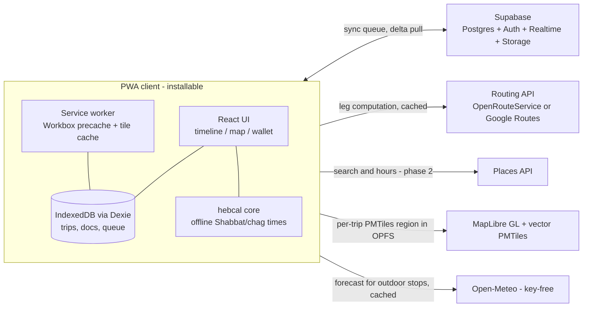

# Tiyul — Multi-Constraint Travel & Group Logistics Planner

**Product design v0.2 · August 2026** — v0.1 revised after competitive research (competitors / Reddit pain-mining / OSS+technical validation; see D-014…D-017)
Working name: **Tiyul** (טיול — "trip/outing"). Alternatives: Maslul, Derech, PlanIt.

---

## 1. Problem & vision

Planning a multi-family trip today means a WhatsApp group, two spreadsheets, screenshots of tickets, and one person holding the whole schedule in their head. Nothing checks that the plan actually *works*: that you reach the nature reserve before last entry, that lunch lands inside the kids' meal window, that you're checked into the tzimmer before Shabbat, that there are enough car seats on the day the second family joins.

**Tiyul is a shared, offline-capable trip plan that understands the constraints that shape real family travel — and flags problems at planning time, not in the parking lot.**

### Principles

1. **The plan is a living timeline, not a document.** Every edit recomputes drive times, arrival times, and conflicts.
2. **Constraints are first-class.** Opening hours, meal windows, Shabbat times, drive-stretch limits for kids — the app knows them and checks them continuously.
3. **Offline is the default assumption.** Desert hikes, airplane mode abroad, dead zones in the Golan — the full plan, tickets, and maps must work with zero bars.
4. **Built for groups without friction.** Partial attendance, multiple cars, split costs; people can view and RSVP via a link without installing anything.
5. **Israel-aware, world-ready.** Hebrew calendar, Fri–Sat weekend, kosher filters, Waze deep links — plus time zones, flights, and currencies for trips abroad.
6. **Private by default, never hostage.** No telemetry, no ads; the plan is always exportable (single-file HTML, calendar). Trust is a feature — families remember apps that lost their trips.

### Why existing tools fall short

- **Google Sheets/Docs** — the real incumbent (per user research): zero-ceremony structure and frictionless account-free sharing, but no drive times, no conflict checks, "someone has to be the manager" money math, and poor day-of mobile/offline UX. Our accountless links + desktop-first planning must match its strengths; our engine beats its weaknesses.
- **Spreadsheets + WhatsApp at N families** — chaos: unread messages, versioned PDFs, one burned-out organizer.
- **TripIt / Kayak Trips** — booking organizers, not planners ("things with reference numbers"); no group logistics, no constraint checking.
- **Wanderlog** — closest commercial competitor: itineraries + drive times, but no constraint engine, no Shabbat/kosher awareness, weak partial-attendance; offline and attachments are paywalled (our free core).
- **Troupe** — group consensus (dates, votes, RSVPs) without day-of logistics or a timeline engine.
- **TREK (OSS, ~11k stars)** — collaborative planner with polls/expenses/documents, but no constraint engine, no offline editing, no Shabbat/RTL awareness.
- **Nobody found** has: planning-time constraint validation, per-activity RSVP driving expenses/seats, accountless participation, or frozen offline bundles as a unit — the whitespace this product occupies.

---

## 2. Users

| Persona | Needs |
|---|---|
| **The Organizer** (primary) | Plans 4–6 trips/year for 2–3 families. Wants to stop being the human constraint-checker. Power editor. |
| **The Co-planner** | Spouse/friend who edits occasionally, mostly on phone. Needs zero learning curve. |
| **Grandparents** | Join some days. Pace constraints: rest breaks, limited walking, accessible stops. |
| **Kids (3–12)** | Not users, but the source of the hardest constraints: meal windows, nap windows, max continuous drive, kid-friendly activity filters. |
| **The Friends' Family** | Joins day 2–3 only, drives their own car, wants to see "their" schedule and pay their share. Views via link, no install. |

---

## 3. Core scenarios (acceptance narratives)

**S1 — North weekend with grandparents (domestic, Shabbat).**
Two families + grandparents, Thu–Sat in the Golan. The app: computes drive legs with a "kids loading" buffer; flags that the Friday plan reaches the cable car after last entry; auto-inserts Shabbat candle-lighting time for the tzimmer's location and warns the check-in is too tight; filters lunch options to kosher; grandparents RSVP out of the water hike and the plan shows a parallel "easy option" block for them.

**S2 — Two families in Greece (abroad, flights, money).**
Flights anchor day 1 and day 7. Timeline shows local times; the flight day shows both clocks. Villa, boat tour, and car rentals live in the wallet with confirmation QR codes — all available offline. Expenses recorded in EUR, split by who attended each item, settled in ILS at trip end.

**S3 — Friday day-trip with friends (fast, decided by poll).**
Organizer drafts two options (beach day / Ein Gedi day), group votes by Wednesday 20:00, winning option becomes the plan. The app warns the Ein Gedi option: "Snake Path closes at 15:00 for heat — start by 08:30" and checks everyone is home before Shabbat.

---

## 4. Feature specification

### 4.1 Dynamic Itinerary Builder

The core surface: a **day timeline** of time blocks with computed travel legs between them.

- **Structure:** Trip → Days → Stops (activity, meal, lodging, flight, free block). Drag to reorder; drag edges to resize duration.
- **Auto legs:** driving time + distance computed between consecutive stops (routing API, cached). Every edit recomputes depart/arrive times downstream.
- **Buffers:** group profile defaults (e.g., +15 min "loading the car with kids", +10 min parking at popular sites); per-stop override. Buffers render as visible chips, not invisible padding.
- **Anchors vs floaters:** fixed-time items (flights, reservations, guided tours) pin the timeline; flexible items float and slide between anchors. Slack is shown, so you can see where the day can absorb delays.
- **Map pane:** stops pinned per day (color-coded), leg polylines, tap a pin to jump to the block.
- **Deep links:** every leg gets a **Waze** / Google Maps button (Waze is the Israel default); every stop can hold links (official site, booking page).
- **Templates:** duplicate a day or a whole trip; save "our Golan weekend" as a starting point.
- **Idea shortlist (M2):** an unscheduled "maybe" pool per trip — anyone adds places/links from the share link, the group votes, winners get dragged onto a day. Planning starts before a schedule exists (the "zero-to-draft" phase apps skip and spreadsheets own).
- **Desktop-first planning, phone-first execution:** serious planning happens on a laptop with twenty tabs open (the spreadsheet lesson); the day-of surface is the phone. Both are first-class — desktop is not an afterthought port. Layouts respect browser/OS font scaling (grandparents persona).
- **Undo/redo (store from M0, UI in M1):** the store is op-based from day one, so every edit — including a drag that cascaded a recompute — is reversible. Spreadsheet refugees expect Ctrl+Z; phones guarantee accidental drags.
- **Parallel tracks (v2):** split the group for part of a day (hikers vs. grandparents+toddlers), rejoining at a shared stop. MVP approximation: parallel "alternative block" with participant tags.

### 4.2 Constraint Engine (the differentiator)

Users declare constraints once; the engine validates the computed schedule after every edit and data refresh.

**Constraint categories**

| Category | Examples | Source |
|---|---|---|
| Temporal | opening hours, last entry, fixed reservation, "home by 21:00" | manual, place data |
| Transit | max continuous drive (per group profile), min buffer between blocks | group profile |
| Human needs | meal windows (kids 12:00–13:30), nap window, rest break every 2h of driving | participant profiles |
| Suitability | kid-friendly, stroller/wheelchair accessible, difficulty ≤ moderate, budget cap | activity tags + filters |
| Calendar | Shabbat/chag entry & exit per location, closed days (Israel: many things closed Sat; abroad: museums closed Mon) | auto (Hebrew calendar lib) + place data |
| Group | enough seats/car seats on each day, headcount vs. reservation size | vehicles + RSVPs |

- **Hard vs. soft:** hard = plan is infeasible (arrive after last entry); soft = quality warning (lunch 40 min past the kids' window). Severity is configurable per constraint.
- **Participant-scoped:** constraints apply only when the affected people attend that stop (grandparents' pace limits don't restrict the couples-only evening).
- **Conflict presentation:** badge on the offending block + a conflicts drawer listing all issues, each with plain-language explanation and **quick fixes**.
- **Dismissal & stable identity (M1, D-020):** every conflict has a stable identity (rule + subject blocks), so an acknowledged soft conflict ("yes, lunch is late — we know") stays dismissed across recomputes and reappears only if it escalates (soft → hard) or its facts materially change. Without this, warnings become noise and the engine's credibility — the product's moat — dies of alert fatigue. Dismissals are per-trip, visible in the drawer under "acknowledged".
- **Quick-fix engine (MVP heuristics, not a full solver):** shift within available slack · shorten a flexible block · swap adjacent stops · insert a rest break · drop-with-confirmation. Each suggestion previews its downstream effect ("pushes dinner to 19:40"). M3 adds **"suggest a better order"** — reorder the day's flexible stops to cut total drive time (the feature Wanderlog/Roadtrippers paywall).
- **Weather-aware checks (M3):** forecasts via **Open-Meteo** (key-free) attach to outdoor-tagged stops; HEAT_WINDOW and rain warnings run on real forecast data, cached into the offline bundle with a "forecast as of" stamp.
- **Auto-solver (later):** constraint-satisfaction pass that proposes a feasible reordering of a day ("make this day work").

**Initial rule set**

| Rule | Default severity |
|---|---|
| OVERLAP — blocks collide | hard |
| TRANSIT_IMPOSSIBLE — can't reach next stop in time | hard |
| ARRIVE_AFTER_CLOSE / AFTER_LAST_ENTRY | hard |
| CLOSED_DAY — stop closed that weekday/holiday | hard |
| SHABBAT_CONFLICT — activity/drive crosses Shabbat or chag for observant participants | hard (per family profile) |
| SEAT_SHORTAGE — people > seats (incl. car-seat types) that day | hard |
| BOOKING_REQUIRED_MISSING — reserve-ahead site with no booking attached | soft |
| MEAL_WINDOW_MISS / NAP_WINDOW_MISS | soft |
| DRIVE_STRETCH_EXCEEDED — continuous drive > profile max | soft |
| NO_BUFFER — back-to-back anchors with < min buffer | soft |
| HEAT_WINDOW — strenuous southern-Israel hike planned 10:00–16:00 in summer | soft |
| CURFEW_MISS — "home/hotel by X" violated | soft |

### 4.3 Offline-First PWA

Installable PWA (Add to Home Screen, iOS + Android), app shell precached.

- **"Take trip offline"** bundles: full trip data; **vector map regions** as per-trip **PMTiles archives stored in OPFS** (single portable file per region — typically tens of MB, not hundreds; service-worker range-request caching is unreliable across browsers, so the archive is stored whole and served locally); route geometries and last-computed leg times (stamped "computed Jul 30"); all wallet items (tickets, PDFs, QR codes); constraint data incl. pre-computed Shabbat times and cached weather (calendar lib runs fully offline).
- **Storage manager:** per-trip size estimate via `navigator.storage.estimate()`, `persist()` requested on install (home-screen PWAs get browser-level quota on iOS and are exempt from the 7-day eviction), download-over-Wi-Fi prompt, evict old trips. Typical bundle: tens of MB; hard ceiling 400 MB. Local data is always a re-downloadable cache, never the sole copy.
- **Offline editing:** edits queue locally (IndexedDB) and sync on reconnect; MVP conflict policy = last-writer-wins per field with a "changed while you were offline" review list; the designated upgrade path when concurrency demands it is **PowerSync** (D-005), so queue entries stay row-shaped.
- **Wallet:** attach tickets/confirmations (PDF, image, QR) to stops or the trip; one tap from the timeline block at the entrance gate. Sensitive docs (passports) stay device-side in v1 (see Open questions).
- **Status honesty:** every screen shows offline state and data freshness; leg times shown as "as of <date>" when offline.

### 4.4 Group logistics

- **Roles:** organizer / editor / viewer. Invite via link with WhatsApp-friendly preview; viewing and RSVP require **no account** (magic link identity), editing requires sign-in. Share links carry a **hide-costs toggle** (M2) so money stays between the paying parents (a verbatim user ask about competitors).
- **RSVP per day and per stop:** attendance drives everything — headcounts on each block, restaurant table size, ticket counts, seat checks, expense splits.
- **Vehicles & seating:** define cars (seats, car-seat slots, driver); assign per day; SEAT_SHORTAGE conflicts surface automatically ("Day 2: 11 people, 9 seats").
- **Polls:** options with deadline; auto-close; winning option can insert directly into the timeline. Includes a **date-grid poll** (when2meet-style, M2) for the "when can everyone go" decision that starts every multi-family trip.
- **Task claims (M2):** the claim mechanic generalizes beyond lists to planning tasks — "who researches the villa", "who books Timna" — with due dates and done ✓. Attacks the №1 researched pain: organizer burnout.
- **Announcement blasts (M3):** one-way organizer broadcasts with push ("RSVP by Friday", "leaving 8:00 sharp"). A megaphone, deliberately not chat.
- **Expenses:** multi-currency entry, payer + beneficiaries (defaults to the stop's attendees), running balances, minimal-transfer settle-up, ILS conversion at trip-average rate, CSV export. M2 adds **payment deep links** on settle-up (Bit/Paybox in Israel, Venmo/PayPal abroad — links only, never in-app payments); M3 adds **budget-vs-actual** per category with simple charts (the organizer's real question: "are we over?").
- **Shared lists — shopping & packing:** a consolidated **shopping list** (categories, quantities, "who buys" claims, bought ✓) and a **gear/packing list** with claims ("who brings the mangal"), plus personal checklists from templates (beach day, hike, flight abroad). A bought item converts to an expense in one tap, split among its beneficiaries (default: the whole group). Lists are editable from the accountless share link — any parent can tick items from the supermarket aisle. M3: packing checklists **auto-seed from the itinerary's stop tags** (hike/beach/baby) — we already know the trip, PackPoint-style.

### 4.5 Israel pack

- **Hebrew calendar awareness:** candle-lighting/havdalah per location & date (via `@hebcal/core`, offline-capable); chagim auto-marked; per-family observance profile decides whether Shabbat generates hard constraints, soft warnings, or nothing.
- **Fri–Sat weekend logic:** opening-hours checks understand erev-Shabbat early closures and Saturday closures.
- **Kosher filters:** restaurant suggestions filterable by certification level (rabbanut / mehadrin); meat/dairy tagging for meal planning.
- **Nature & parks:** "booking required" flags (Masada sunrise, Ein Gedi in season), Israel Nature & Parks pass (Matmon) noted on relevant stops, seasonal advisories — summer heat windows for southern hikes, winter flash-flood risk in desert wadis.
- **Navigation reality:** Waze deep links as the primary nav action; Moovit link for transit users.
- **Optional safety layer:** regional advisories (Home Front Command guidelines) as an opt-in informational layer on trip areas.
- **Language:** full Hebrew UI with RTL layout; dates shown in Gregorian + Hebrew calendar where relevant.

### 4.6 Abroad pack

- **Time zones:** every stop carries its zone; timeline renders local time; flight days show origin+destination clocks; "call home" helper shows the offset.
- **Flights:** structured flight blocks (PNR, terminal, gate notes) with check-in reminder offsets (T-24h) and airport-buffer defaults (international: 3h).
- **Money:** expenses in local currency, trip base currency, offline-cached exchange rate with manual override.
- **Pre-trip checklist:** passports validity, visas, travel insurance, roaming/eSIM, plug type & voltage per country, driving-side note.
- **Observant travel (optional):** kosher restaurant / Chabad locator links per city; Shabbat times work worldwide automatically (hebcal is location-based).

### 4.7 Import & export (added in v0.2 — the "never hostage" surface)

- **Single-file HTML export (M1):** the whole plan as one self-contained, offline-readable, print-friendly file (print = PDF). Shareable anywhere; survives airplane mode, vendor death, and skeptical grandparents. Answers the spreadsheet crowd's deepest objection to apps: "no one can vanish my plan."
- **Calendar export (M2):** static `.ics` download + **auto-updating subscription feed** per trip — and per person, containing only the stops they RSVP'd to. Spouses who live in their work calendar see the plan without opening the app.
- **Confirmation import (v2 flagship, D-016):** forward booking emails to a trips@ address → flight/lodging blocks auto-created. **Booking remains a non-goal; importing already-made bookings is a different job** — the single most-loved feature in the category (TripIt/Kayak), and TripIt's 2024 import breakage left its users shopping for alternatives.
- **Flight status alerts (v2):** delay/gate push tied to imported flights; needs paid flight-data APIs, rides on import.

---

## 5. Information architecture

```
Trips list
└── Trip home  [tabs: Plan · People · Lists · Wallet · Money]
    ├── Plan   → Day strip → Day timeline (core screen) ⇄ map view (per-day / whole-trip)
    │            ├── Stop details (times, links, tickets, attendees, constraints)
    │            ├── Leg details (route, Waze button, buffer)
    │            └── Conflicts drawer (all days or per day)
    ├── People → members, roles, RSVPs grid (people × days), vehicles & seats
    ├── Lists  → shopping (categories, qty, who-buys, bought ✓ → expense) ·
    │            gear/packing claims · personal checklists
    ├── Wallet → tickets/docs by day, offline status per item
    ├── Money  → expenses, balances, settle-up
    └── Trip settings → offline bundle, sharing, profiles (buffers, meal/nap windows,
                        observance level, drive limits), base currency, language

The map is a view mode of Plan (timeline ⇄ map toggle), not a separate destination —
keeps the tab bar at five and matches how the day editor already pairs them.
```

---

## 6. Data model



**Key entities (abridged fields)**

- **Trip** — name, date range, base currency, locale, offline-bundle state, share settings.
- **Day** — date, note, color; derived: Shabbat/chag flags per lodging location.
- **Stop** — type (activity/meal/lodging/flight/free), place (name, lat/lng, address, links), planned start/duration, anchor?, buffer override, tags (kosher, kid-friendly, accessible, booking-required), cost estimate.
- **Leg** (derived, cached) — from/to stop, mode, distance, duration, polyline, computed-at timestamp.
- **Participant** — name, contact, profile (meal/nap windows, drive tolerance, observance level, mobility), is-child + car-seat type.
- **Constraint** — type, scope (trip/day/stop/participant-set), params, severity.
- **Conflict** (derived) — stable identity (rule id + subject blocks), severity, message, suggested fixes, dismissed-state (who/when, re-raise-on-escalation).
- **Expense** — amount, currency, payer, linked stop?, split mode, beneficiaries.
- **Document** — kind (ticket/QR/PDF/note), file ref, linked stop/day, offline-pinned.
- **ListItem** — kind (shopping / packing), category, label, quantity + unit, note, claimed-by (family/person), status (open / bought / packed), linked expense (optional).

**Cross-cutting data rules (D-018, D-019):**

- **Times are local wall-clock + IANA zone, never UTC instants.** A 09:00 hike stays 09:00 through DST shifts and cross-zone edits; flights carry origin-zone departure + destination-zone arrival. Only derived/audit fields (leg computed-at, sync timestamps) are UTC instants.
- **The schema is versioned from day one.** Every schema change ships a Dexie migration and its migration test; every export (HTML, future JSON) embeds the schema version. Long-lived offline data is a contract — "never hostage" includes never corrupted by an upgrade.

---

## 7. Architecture & stack



| Decision | Choice | Rationale |
|---|---|---|
| App model | **PWA** (React + TypeScript + Vite) | Screenshot requirement; one codebase; installable; no app-store friction for family/friends |
| Offline | Workbox SW + **Dexie/IndexedDB** + per-trip bundles | Proven PWA offline stack |
| Maps | **MapLibre GL + vector PMTiles** region archives in OPFS (pmtiles protocol; SW precaches style/glyphs/sprites) | One portable file per region, ~10× smaller than raster pyramids; SW range-request caching is unreliable across browsers; Google tiles can't be cached at all. Evaluate `maplibre-offline-pmtiles` before building our own |
| Weather | **Open-Meteo**, key-free | Forecast joins the constraint engine (heat/rain on outdoor stops); no API-key ops; cached into offline bundles |
| Drive times | **OpenRouteService** first (free tier), abstraction layer so Google Routes API can swap in | Cost control; cached aggressively; frozen values offline |
| Hebrew calendar | **`@hebcal/core` v6** in-client (ESM-only, ~54 KB gz) | Accurate zmanim per lat/lng, fully offline. Set the Israel/Diaspora flag **per trip location** (changes holiday scheduling); Jerusalem candle-lighting default is 40 min, not 18; show "times are approximations — consult your halachic authority" near displayed times |
| Backend | **Supabase** (Postgres, Auth, Realtime, Storage) | Fast to ship; realtime channels give live group editing; row-level security for share links |
| Sync policy | Offline queue + LWW-per-field (MVP) → **PowerSync** when concurrency proves it (not CRDTs) | PowerSync is the only 2025-vintage engine with first-class Supabase offline (official partner, local SQLite, OPFS on web); queue entries stay row-shaped so migration is mechanical |
| i18n | i18next, **he + en, full RTL** | Family reality |
| Auth | Google + phone OTP; viewer links need no account | Lowest friction for the group |
| Hosting | Vercel/Netlify + Supabase cloud | Zero-ops |

**Places/opening-hours data:** MVP = manual entry + paste-a-link (Google Maps URL parsed for name/coords). Phase 2 = Places API for search, hours, and "closed that day" checks. This avoids the biggest external cost until the core proves itself.

---

## 8. Roadmap

| Milestone | Scope | Exit criterion |
|---|---|---|
| **M0 — Skeleton** (~2–3 wks) | Trip/day/stop CRUD, drag timeline, manual durations, Waze links, local-only storage. Foundations that are 10× cheaper on day one: op-based store (undo-ready), wall-clock time types (D-018), schema-versioned DB + migration harness (D-019), i18n/RTL scaffolding, deploy previews + staging (D-021) | **The Yahel field test (D-022):** the real 3-family trip (Aug 28–31) is planned in the app and used in the field — real usage seeds REGRESSIONS.md |
| **M1 — It thinks** (~6–8 wks) | **Opens with two time-boxed spikes (D-022): real-iPhone storage/persist() test + PMTiles offline render proof.** Then: auto drive legs + buffers, anchors/floaters, core conflicts (overlap, transit, closing, Shabbat, curfew) with **dismissal semantics (D-020)**, undo/redo UI, offline bundle v1 (data + wallet), read-only share link, **single-file HTML export** | The app catches a real planning mistake before the trip does; full plan usable in airplane mode; exported plan opens with zero bars |
| **M2 — It's social** | Accounts/roles, RSVPs per day/stop, polls incl. **date-grid**, **idea shortlist**, vehicles & seat checks, expenses v1 + settle-up with **payment deep links** (Bit/Paybox/Venmo/PayPal), shared shopping/gear lists v1 + **task claims**, **hide-costs toggle** on share links, **calendar export (.ics + live feed)**. **Ships only after a documented security & privacy review (D-022):** threat model for share links (entropy, revocation), RLS policy review, rate limiting, no PII in logs, and **trip deletion purges server data** | A friend joins day 2 by link, votes on dates, RSVPs, claims a task and a shopping item, sees their cost — no install; the plan appears in a spouse's work calendar |
| **M3 — It's deep** | Offline map regions (**PMTiles/OPFS**), quick-fix suggestions incl. **reorder-for-less-driving**, **weather-aware rules via Open-Meteo** (heat/rain), meal/nap rules, **budget-vs-actual**, **announcement blasts**, packing templates + **auto-seed from stop tags**, abroad pack (time zones, flights, currency), Places API integration | Full S1 and S2 scenarios pass end-to-end |
| **Later / v2** | **Flagship v2 bet: confirmation email import (trips@) + flight status alerts (D-016)** · auto-solver ("make this day work") · transit mode · parallel group tracks · AI drafting, framed as *AI drafts, the constraint engine verifies* · post-trip memories (route track, shared family album, printed book) · receipt OCR itemization · villa room/bed assignments | — |

---

## 9. Non-goals (v1)

- Booking or payments inside the app (link out to booking pages). *Clarified in v0.2:* importing **already-made** bookings is a different job and is the flagship v2 bet (§4.7, D-016); payment **deep links** on settle-up are links, not payments, and are in (M2).
- Chat (WhatsApp already won; we integrate via share links). One-way announcement blasts (M3) are a megaphone, not chat.
- Turn-by-turn navigation (deep-link to Waze/Google Maps).
- Flight/hotel search or price tracking.
- Public/social trip feeds. Live location sharing was evaluated (Polarsteps-style) and stays out — privacy stance (D-017); private post-trip memories remain a v2 candidate.

All five re-confirmed by the 2026-08-01 competitive research — each is a product in itself that an incumbent already won.

## 10. Open questions

1. **Places data cost** — when does Places API (paid) beat manual entry + link parsing? Decide during M2 with real usage.
2. **When to adopt PowerSync** — the *which* is decided (D-005, updated: PowerSync, not CRDT); instrument M2 for concurrent-edit conflicts to decide the *when*.
3. **iOS PWA storage ceilings** — largely answered (WebKit policy: home-screen apps get browser-level quota, exempt from 7-day eviction, `persist()` honored since iOS 17; and PMTiles regions shrink bundles to tens of MB). Remaining: one real-device spike with an oversized bundle in M1, since in-the-wild evidence for very large PWAs is thin.
4. **Passports/IDs in wallet** — encrypted storage is a liability; v1 keeps official IDs out (device gallery instead). Revisit only with strong demand.
5. **Safety advisories layer** — include Home Front Command feed at launch or keep manual? Opt-in either way.

## 11. Success criteria

- A 3-day, 2-family north trip planned in **under 30 minutes**.
- **100% of the trip** — schedule, tickets, maps, Shabbat times — readable in airplane mode.
- Zero "arrived after closing / missed last entry" incidents across real family trips in the first season.
- At least one friend-family participates fully (RSVP + expenses) **without installing anything**.
